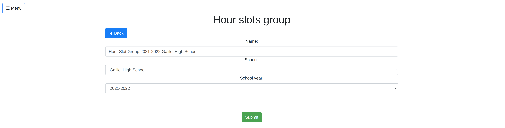
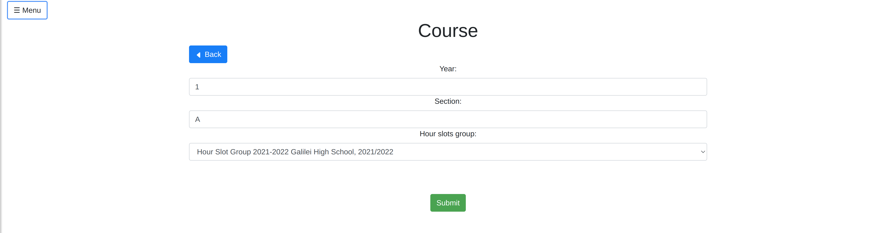
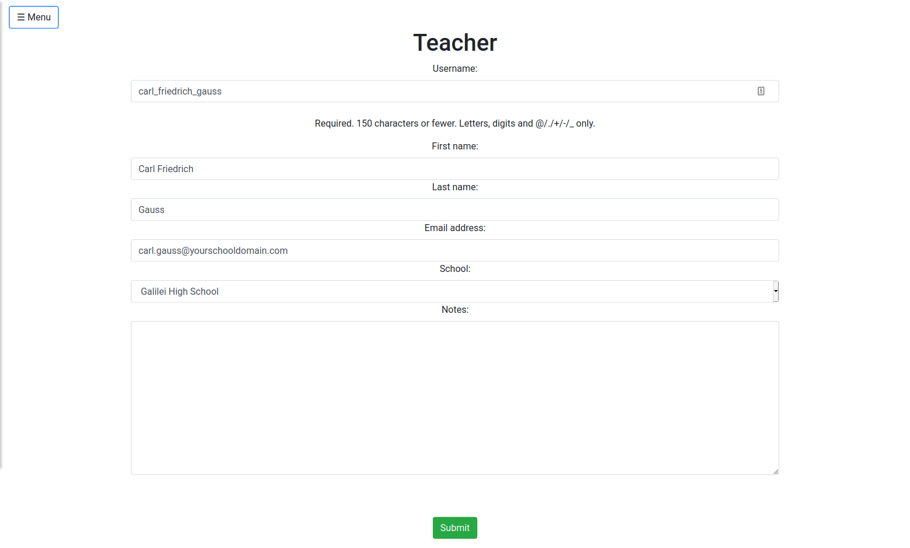
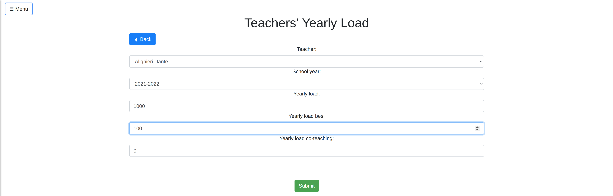
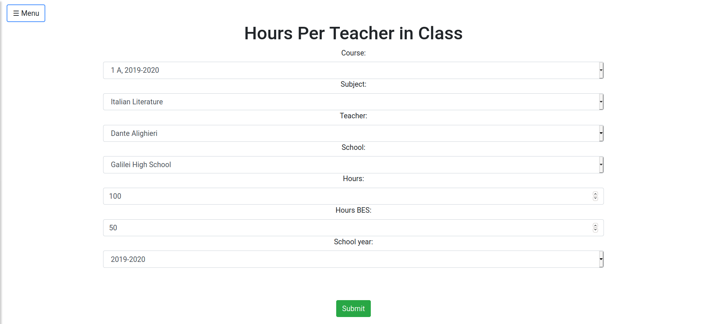
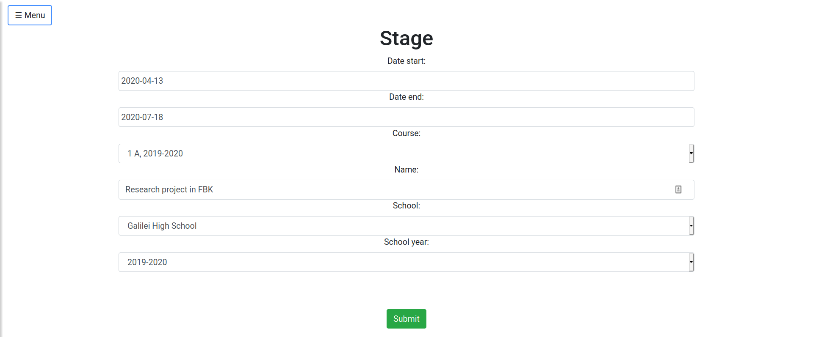
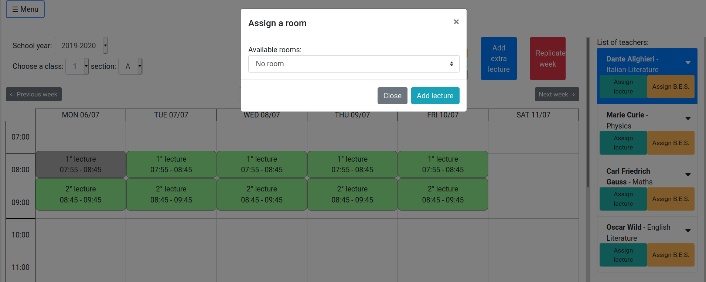
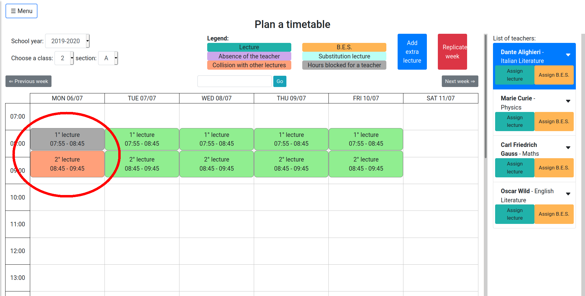
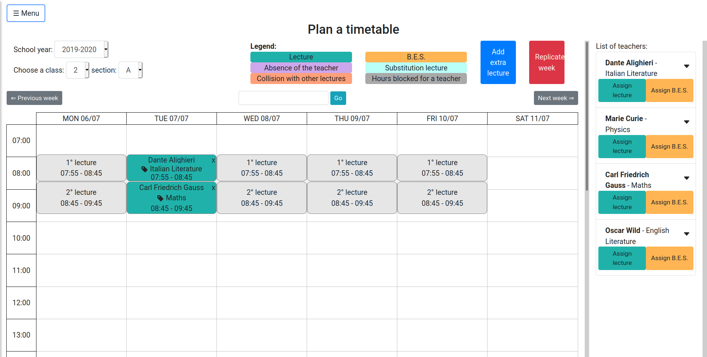

[TOC]

## Presentation
We know how hard is the process of creating the calendar of a school: all classes cannot be left without a teacher, still no teacher can be assigned to multiple classes at the same time - unless time travel were possible, but this is definitely another story ;). And moreover, at the end of the year all teachers must have done their yearly amount of hours per class. And what if some teacher substitutions were necessary during the year due to illness? It's a nightmare!

But no worry, we may have made your life much easier: SchoolCalendar helps you to create the calendar for your school! 

This website allows you to keep track of teachers', classes' and rooms' availability in your school, so that no conflict is made while you create the timetable. If you are the admin for the school, an interactive page lets you build the timetable, whereas all teachers can see their weekly load by checking their personal account. Moreover, there is the possibility to manage the dinamic substitutions of teachers that happen often during the year, and you can keep track of how many hour every teacher is missing to reach their target by visualizing annual reports.

Next sections will present you a comprehensive guide on how to install it and how to operate when you have the service up and running.

Do you want to give it a try? Get in touch with us: https://schoolcalendar.it/.

Let us now start!

## User Guide

### Initialization

You are the headmaster of a school, and have obtained a valid account's credentials (yay!): what do you need to do now?

Well first of all open a browser (we highly discourage you to use whichever version of IE), type the website URL and login.

You should see something like:


Now open the menu at the upper left corner, click the `Manage entities` button, open the instance you want to edit (like `Teacher`) and start adding the objects you will need to have the service working (using the button `+ Add new`). We make a brief tour of them:

- **Teacher**: the teachers in your school. For every teacher an account will be created, so that the teacher in question will be able to consult her own timetable whenever she wises. The ```username``` is the login credential (so choose it carefully, no spaces are available). We advise using lowercase `firstname_lastname`, i.e. `dante_alighieri`.  The `email` address that you insert will receive an email by the website, so that every teacher can choose her own password and finish the registration (you will not need her to finish the registration, the Teacher will be usable in the system as soon as you create it)! The email is not sent automatically, but rather it is sent clicking the button left menu -> Manage entities -> Teachers -> Send Invite.
- **Course**: for instance, class IA or whatever. The field `Year` is a number (not Roman!) for the year of the class (in our example, class IA has `Year` field set to 1). The section would instead be `A`. 
- **Room**: for maximal flexibility, you can optionally register into the system all the rooms of your school. In this way, you can keep track of the conflicts happening in the rooms (the same room cannot be used concurrently by too many courses). Watch out, the field `Capacity` does not stand for how many pupils can fit into the room, but how many courses can be there concurrently (imagine a large laboratory or the gym, we may have multiple courses all having class there at the same time). We still expect that the vast majority of the rooms will have capacity of 1.
- **Subject**: the subjects taught in the school (Maths, Literature and so on).
- **Holiday**: you do not want your poor teachers and pupils to work at Christmas ;) The holiday period specified will be valid for all the courses of the school! Try to insert one, you will see it painted in orange in the home page calendar!
- **Stage**: same as holiday (no class can be held if there is a stage that day), but this time it is specific for a single course.
- **Hour Slot**: this is the slot in which a lesson can be taught. For instance, assume that on Tuesday the third hour goes from 11:05 to 11:55. Then the field `Hour number` is 3. Still, when you count how many hours a teacher has done during the year, you may want to count the class duration as 1 hour, even if it lasts only 50 minutes (after 6 classes of 50 minutes, the teacher has done actually only 5 hours!). This is what the `Legal Duration` field is for! (You can set it with hours and minutes, but we believe that the vast majority will be 1 hour and 0 minutes). This insertion is going to be a bit painful since you may have potentially 30 or more hour slots in a week! But do not worry, we saved you a bunch of time by letting you decide in which days of the week to repeat the hour slot. For instance, if you want the first hour of the morning from 8:00 to 9:00 to be repeated every morning from Monday to Friday, just select the correct days in the field `Replicate on Days`. In order to select multiple options use the key `ctrl`, or `shift`.
The hour slots are organized in groups, called **Hour Slots Groups**. This entity allows you to manage different hour slots for different courses in an easy way. In some schools, some courses have an hour configuration, while others have a completely different one (E.g. The course `1A` starts the first lesson at 7.45, while the course `1B` starts it at 8.15). In this case, two different hour slots groups can easily handle the two hour slots configurations avoiding collisions and problems. On the other hand, if your school has the same hour configuration for all the classes during the same academic year, then you will need only on hour slots group entity.
- **Absence Block**: if any teacher has some chronic unavailability to teach in certain hour slots, you can register them using the `Absence Block`. When you later check for the availability of a teacher to teach in a certain course, such hour slot will not be considered valid, even if the teacher has no other conflicts at such time.
- **Hours Per Teacher In Class**: this records how many hours of teaching (field `Hours`) any teacher needs to do in every course. Note that when computing the total amount of hours done by the teacher in a course, the field `Legal Duration` of the instance `Hour Slot` is used. If a teacher teaches multiple subjects in the same course (like Physics and Maths), she needs multiple Hours Per Teacher In Class (one for Math, the other for Physics in the example). The `Hour BES` field is meant for special hours of teaching (like hours done with pupils carrying disability and so on). If your school does not have such special hours, just leave them set to zero. Co-teaching hours are explained in the dedicated section below.
- **Secretary**: the secretaries of your school that need to see all the timetables. This is necessary if, for instance, a secretary needs to send an urgent communication to a teacher and wants to know where the teacher is teaching now. Secretaries have even the possibility to download the excel reports with the timetables of courses, teachers and rooms. 
- **Teachers' Yearly Load**: the total amount of hours that a teacher should teach in an academic year. The hours are divided in normal hours, B.E.S hours and co-teaching hours. *This is an optional entity that can help while creating a timetable to immediately compare the number of hours assigned to a teacher and the desired yearly load for that teacher.* 
- **Courses' Yearly Load**: the total amount of teaching hours that a course should have in an academic year. The hours are divided in normal hours and B.E.S hours. *This is an optional entity that can help while creating a timetable to immediately compare the number of hours assigned to a course and the desired yearly load for that course.* 

Fill these fields carefully! All the information that you provide to the website must be correct, or it will work (of course) in an unexpected manner!

### An example creation of entries 
Now that we have done the initialization step, we can finally start to use the service! We guide you through this process in this subsection.

For the sake of the example, we just created a School Admin account (the same type of account that you are using right now) called John Doe, who is the manager of the school called "Galilei High School". You cannot create a school nor a school_year with your current account: you have to ask the administrators (the same guys who created for you your account) of the website to add your `school` and the `school_year` to the system!

Now that we have everything up and running we start to fill what is necessary in order to utilize properly the website: let us start by the basis, and insert some hour-slots. Open the left menu, click the `Manage entities` option and select `Hour-Slots`. Add a new Hour Slot Group for the current school year.



You should see now a list of all your hour slots groups:


Click the `Edit blocks` button, and add the individual hour slots (with the green button `+ Add new`).


(Note that in this case the hour lasts physically speaking only 50 minutes, but the legal duration makes sure that it is going to be counted as a full hour long lesson). We insert both the hour slot for the first hour (7.55-8.45) and the second hour (8.45-9.35)


We now insert a few courses (1A, 2A, 3A, 4A, 5A): go to left menu -> Manage entities -> Courses -> Add new, and fill the forms with the information for the various courses (careful, if the course is 1A, then the year is 1 - it must be a number - and the section is A). For example:



Notice that the Hour Slot Group field defines the school year of the current Course: in fact, you might have that there is a Course IA in both school year 2020-2021 and 2021-2022: you can differentiate among them by simply looking at the Hour Slot Group field! 

We now insert some subjects (left menu -> Manage entities -> Subjects -> Add New): Maths, Physics, Italian Literature, English Literature. The Color field is used to define the color they will appear on the timetable.

Let us now insert a few rooms: you do not need to insert all of them (although you are not prohibited either from doing so), but just the ones you believe will be likely to have conflicts (for instance, the laboratories that can be used by multiple courses).

In order to add some rooms go to left menu -> Manage entities -> Rooms -> Add new. We create a couple of rooms, the Physics laboratory (with capacity 2, which means that can be used concurrently by two courses and not that it can fit only two students) and the Multimedia Laboratory (with capacity 1).


It is time to add some teachers: go to left menu -> Manage entities -> Teachers -> Add new, and create a few teachers. We are going to create for this example the teachers Marie Curie, Dante Alighieri, Oscar Wilde and Carl Friedrich Gauss. 

Note that: the `username` field is going to be the username that the teacher will use in order to login - choose it carefully, there cannot be duplicates and it cannot contain spaces (we advise to use firstname_lastname, for instance dante_alighieri can be the username of the teacher Dante Alighieri). The email is instead required since the teacher is going to receive an email from SchoolCalendar, so that she can set her own password (she will use the account to check her personal timetable, she will not be able to alter anything since she is not an admin as you are!). The email is not sent automatically: you need to click the button `Send Invite` in the page left menu -> Manage entities -> Teachers.



We create now an absence block: our poor Dante cannot be present at school from 7:55 to 8:45 on Mondays, since he has to take care of his old friend Virgilio. Just go to left menu -> Manage entities -> Absence Blocks -> Add new, and fill the form with Dante's information.


Now we insert the important information regarding the teachers and courses: how many hours does every teacher need to teach in every course.

First, we insert how many hours every teacher needs to teach according to her contract for the entire school year. We expect this number to be around 1000 hours per year.

Go to left menu -> Manage entities -> Teachers' yearly load -> + Add new and insert the information.



The same happens for Courses: go to the left menu -> Manage entities -> Courses' yearly load -> Add new and fill how many hours every course needs to do by the end of the school year.

Now, we need to insert how many hours every teacher needs to teach in every course, and for what subject (for instance, if a teacher teaches both Math and Physics in the same course IA, you need to insert both HourPerTeacher, one for Math and one for Physics). 

To keep things simple, we just say that every teacher in our example teaches her own subject (Dante -> Italian Literature and so on) in courses 1A and 2A. For the sake of the simplicity of the example, we just assign 100 normal hours to every teacher in every course, apart from Dante in 1A, who teaches both 100 normal hours and 50 BES. Go to left menu -> Manage entities -> Hours per teacher -> + Add new.



Lastly, we insert some holidays and some stages. First, go to left menu -> Manage entities -> Holidays -> Add new and create a new holiday: 


Notice that if you create a holiday on a day when some teacher is working, you will be warned that the teacher's job is going to be deleted (since there is a holiday)!

Then a stage for class 1A: left menu -> Manage entities -> Stages -> Add new.



You can check how those two instances are rendered in the timetable: go to left menu -> Timetable, go to the desired week using the button `go`, right above the timetable and look for them, they should be fairly easy to spot.

### Teacher Assignment

After we have finished to set all the entries of our mock school, we can finally start to see how the system works. Go to the timetable page (left menu -> Timetable) and start to play with the teachers assignments.
This view shows you the weekly timetable for a specific course and school year (you can select which course and school year to visualize in the upper left menu). Note that the list of teachers in the right column will change according to the course you have selected. If you try to select course 3A, for instance, you will notice that it has no teacher assigned (if you remember, we only add hours for teachers in courses 1A and 2A).

Try now to add an Italian lecture the second hour on Monday in course 1A. Click the button `Assign lecture` in Dante's square, and afterwards select the second hour slot on Monday morning (it should have been filled in green).


It will be asked whether you want to assign a room to this lecture, to which you can say `No Room`.




What about the first hour slot? Why is it still gray and it doesn't turn into green? Simple enough, Dante is by Virgilio's, we have added an absence block for him at that time.

So good so far: let us now add a Math class during the first hour slot on Monday morning. Just repeat the same procedure with Gauss: notice that when you press the button `Assign lecture` under Gauss' square, the Italian lecture we added earlier will appear split in half: this is to let you add more than one teacher during the same hour slot.


Before starting to add lectures in the other course, try to click the downward arrow in the teachers' box in the right column: it will show you a summary of how many hours does the teacher still need to do in the course.

Ok, move on right now in class 2A (using the menu in the top left corner). Try to add a lecture for Dante; as you can see, Monday is off limits: first hour Dante is as usual by Virgilio, second hour instead there would be a conflict with course 1A. It is shown in red.



Add him then during the first hour slot on Tuesday, and add him in the Multimedia Laboratory. If you go back to class 1A, and try to add another teacher (Oscar Wilde) in the same hour slot in the same room, you can notice that you cannot! (The multimedia laboratory won't appear as one of the possible options when choosing the room). Which makes sense, in fact the multimedia laboratory has capacity only one.

If you now add instead a lecture for Marie Curie in the Physics laboratory in course 1A, the second hour of Tuesday, and then do the same for course 2A, putting Gauss in the physics laboratory as well, you notice that you can! The Physics lab can hold concurrently 2 classes together (we created it with capacity 2).

To recap what we have done so far, here is a picture of the classes that we have assigned until now for courses 1A and 2A.




There is the possibility to create some particular hour slots clicking on the blue button "Add extra lecture". This functionality allows you to the lessons that happen extremely rarely and hence cannot be defined as normal hour-slots (E.g. The last day before the Christmas' holidays, the school organizes an event in the evening that, of course, has to be counted as a lecture for the teachers).

### Substitution

We explore now another feature of SchoolCalendar: assume it is Monday evening, and Gauss calls you to tell you that he is ill and will not be able to attend the lecture he has in course 2A. You have therefore to find a right candidate for a substitution. Normally you should consider all lectures that Gauss teaches on Tuesday, look for a candidate to substitute him, check for the candidate's conflicts, and repeat the process for all Gauss' lectures of the day: a nightmare. And with SchoolCalendar? Just a piece of cake. 

Open the left menu -> Substitute a teacher, and fill the form with the correct information (Gauss, on the 7th of July). 


As you can notice, a list of all lectures that you need to fill is proposed to you (in our case, only the second hour of Tuesday).

If you click on it, a list of all teachers will open at your disposal


The information in this page should help you decide who will make the substitution: first, you may want to give the lecture to the teacher with the least hours of substitutions made so far during the year. Moreover, you may want to prefer to give the hour to teachers already at school: note for instance that Oscar Wilde is home on Tuesday both the hour before the substitution and the one after, whereas Dante would already be at school (he teaches the hour before Gauss in course 2A). We believe this information will help you to decide to which teacher to assign the substitution.

In the end, Marie Curie is teaching in another class at that hour, hence she will be listed in `Other Teachers` list: you should not choose her, but if you have very good reasons for doing so, feel free (for instance, Marie Curie's class is doing an educational trip, and she is not one of the accompanists. In this case, the substitution is considered as free, and will not be counted in the final reports).

If we choose Dante, and assign him to the substitution, you will notice in the Timetable page that Gauss is going to be set as absent (purple color) whereas Dante will be set as the substitute (light blue). Good! :)


## Week replication
After filling all the lessons of the first week for a class, you should consider using the "Replicate week" button. It avoids you filling by hand the same exact week for the rest of the academic year. Before using this functionality, you should visualize the template week that you are interested in replicating. The dialog that opens up let you select the target period that you want to fill with the source week. You have a couple of choices to deal with:
- Replicate without substitutions: if enabled, all the substitutions present in the current week are ignored and all the lessons are copying just like every teacher is not absent.
- Remove extra non-conflicting lectures: if enabled, every lesson already present in the target week will be deleted if it does not lead to a collision. If disabled, the extra lectures are kept.

If some conflicting lectures are present (e.g. the same teacher is already teaching in another course), the week replication will fail. To know which lectures are causing conflicts you should click the "Check conflicts" button since it will show you all the conflicting lectures and why they are a conflict.

## Summaries and reports
In the menu there are several pages that help you in managing the whole timetables. 
- **Timetable report**: this page let you download all the timetables that you would need: the room timetable, the course timetable, the teacher timetable and a general timetable that shows all the lectures of your school in a compact way.
- **Teachers summary**: this page provides you a summary of all the teaching hours that a teacher has made compared with her yearly load. If you click the proper button on the left of each teacher, you can obtain his detailed information, to see the teaching hours divided for each one of her courses and subjects.
- **Courses summary**: this page is similar to the Teacher summary one, but instead focused on the courses. For instance, this page can be useful to see how many teaching hours are missing for a course.
- **Substitutions summary**: this page shows, and let you download, all the substitutions made in your school during this academic year. You can also apply several filters like the teacher one, the course one or the period range one in order to let you easily manage them.  

## Co-teaching

It might happen that some external professors are teaching in your school (for example, a mother-tongue English lecturer during the foreign language class). Such external professors usually teach together with the regular professor (e.g. the English professor). Since in the yearly report page you want the number of hours taught by all professors for a specific course to be equal to the number of hours that the course must perform, you do not want to count such hours taught by two teachers concurrently twice. So, what you should do is to assign regularly the hour of the English professor, and add the external professor as a co-teaching hour (co-teaching hours are not counted when doing the annual reports). You can assign a co-teaching hour in the regular timetable page: every professor has three buttons, one green for the regular hours `Assign lecture`, one yellow for BES lectures `Assign B.E.S.` and finally a blue one for co-teaching hours `Assign co-teaching`.
