[TOC]

## Presentazione

Sappiamo quanti sia difficile creare il calendario per una scuola: nessuna classe può essere lasciata senza un insegnante, allo stesso tempo nessun insegnante può essere assegnato a più classi contemporaneamente - a meno che i viaggi nel tempo non siano possibili, ma questa è decisamente un'altra storia ;). E, inoltre, entro la fine dell'anno tutti i professori devono aver compiuto il loro carico orario annuale. E se alcuni insegnanti dovessero essere sostituiti durante l'anno? Un disastro!

Ma non preoccuparti, si dà il caso che ti potremmo aver reso la vita molto più facile: SchoolCalendar è il tool che ti aiuta a generare l'orario per la tua scuola.

Il sito ti aiuta a tenere traccia della disponibilità degli insegnanti, delle classi e delle aule nella tua scuola, così che mentre crei il calendario non ci siano conflitti. Se sei il dirigente della tua scuola (o la persona incaricata di creare l'orario), una pagina interattiva ti permette di generare il calendario; inoltre, tutti gli insegnanti possono vedere il loro orario settimanale loggandosi sul sito sul loro account personale. Inoltre, c'è la possibilità di gestire le supplenze che accadono improvvisamente durante l'anno. E, infine, puoi tenere traccia del carico annuale degli insegnanti e delle classi con dei report annuali.

La prossima sezione ti spiegherà come installare il servizio, e come usarlo.

Voi provarlo? Contattaci: https://schoolcalendar.it/.

Iniziamo!

## Guida Utente

### Inizializzazione

Sei il preside di una scuola e hai appena ottenuto le credenziali del tuo account: ti starai chiedendo cosa tu debba fare.

Per cominciare, apri un browser (sconsigliamo vivamente l'utilizzo di Internet Explorer), inserisci il link al servizio e fai il login con le tue credenziali.

Dovresti vedere una pagina simile a questa:

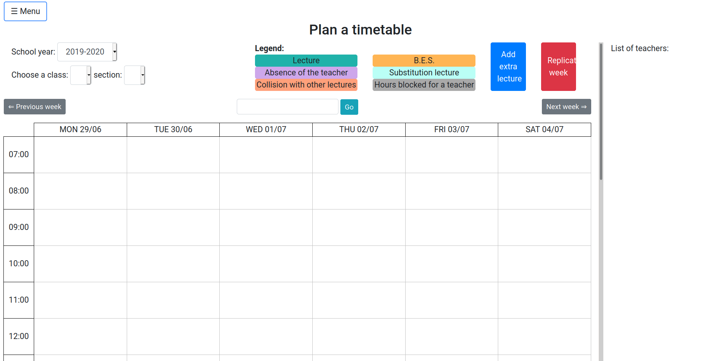

Apri il menù in alto a sinistra, clicca sul bottone `Gestisci le entità`, apri l'istanza che vuoi inserire (ad esempio `Insegnanti`), e inserisci gli oggetti che ti servono per far funzionare il servizio. Facciamo un breve riepilogo delle entità:

- **Insegnante**: i professori della tua scuola. Ogni insegnante avrà il suo account, così che sia per loro possibile visualizzare il loro orario settimanale. Lo `username` è quello che serve per effettuare il login (ergo, sceglilo attentamente: non ci possono essere spazi). Consigliamo di utilizzare come username `nome_cognome`, ad esempio `dante_alighieri`. Il campo `email` serve per invitare gli insegnanti al sito, e far scegliere loro la password dei loro account (anche se gli insegnanti non hanno accettato l'invito, potrai inserirli nel calendario). Da notare che l'email di invito non viene inviata automaticamente: dovrai cliccare sul bottone menù a sinistra -> `Gestisci le entità` -> `Insegnanti` -> `Manda un invito`.
- **Classe**: ad esempio, classe IA. Il campo `anno` è un numero (non romano), nel caso di esempio 1. Il campo `sezione` invece sarebbe A.
- **Aula**: per avere la massima flessibilità, puoi registrare nel sistema ogni aula della tua scuola. In questo modo, puoi tenere traccia dei conflitti che avvengono nelle aule (ci aspettiamo che la stessa aula non possa essere usata da troppe classi contemporaneamente). Fa' attenzione che il campo `Capacità` si riferisce a quante classi possono stare nell'aula contemporaneamente, e non a quanti studenti possano entrare. Ad esempio, un laboratorio o la palestra possono essere usati da più classi assieme. Ad ogni modo, ci aspettiamo che per la maggior parte delle aule la loro capacità sia 1.
- **Materia**: (matematica, letteratura etc).
- **Vacanze**: non vorrai che studenti e insegnanti lavorino a Natale ;) La vacanza è valida per ogni classe della scuola. Se provi a inserirne una, vedrai che viene colorata di arancione nel calendario.
- **Stage**: come una vacanza (non ci possono essere lezioni nelle giornate di stage), ma è specifico per una singola classe.
- **Slot Orari**: è lo slot orario dove le lezioni possono essere tenute. Ad esempio, assumiamo che il martedì la terza ora duri dalle 11:05 alle 11:55. Allora il campo `Numero di ora` è 3. Inoltre, se nei vari report annuali vuoi contare le ore di lezione come un'ora piena, anche se la durata è soltanto di 50 minuti (come nell'esempio sopra), allora puoi specificarlo nel campo `durata legale`. Purtroppo questo inserimento potrebbe essere un po' faticoso, visto che ci aspettiamo ci siano circa 30 slot orari in una settimana: non ti preoccupare, ti abbiamo risparmiato un sacco di tempo, infatti puoi decidere di replicare gli slot orari nei vari giorni della settimana. Per selezionare più giorni nel form di inserimento, usa i tasti `ctrl` e `shift`. Infine, gli slot orari sono raggruppati per gruppi chiamati `gruppi di slot orari`. Questi gruppi ti consentono di gestire diversi orari per le diverse classi, durante lo stesso anno scolastico (ad esempio, la classe IA inizia la prima ora alle 7:45, mentre la classe IB inizia alle 8:15). Ti basterà creare due gruppi di slot orari, uno con le ore che iniziano alle 7:45, l'altro con le ore che iniziano alle 8:15, e il sistema gestirà automaticamente le collisioni e i problemi. Se, invece, la tua scuola ha gli stessi orari per tutte le classi, allora ti sarà sufficiente un solo gruppo di slot orari per ogni anno scolastico.
- **Blocchi di Assenza**: se qualche insegnante ha qualche indisponibilità cronica ad insegnare in determinate fasce orarie, puoi registrarlo utilizzando i `Blocchi di Assenza`. Quando successivamente verificherai la disponibilità di quell'insegnante ad insegnare in una determinata classe, tale Slot Orario non verrà considerato valido, anche se l'insegnante non ha altri conflitti in quel lasso di tempo.
- **Ore per Insegnante in Classe**: tiene traccia quante ore di insegnamento (campo `Ore`) ogni insegnante deve fare in ogni classe. Considera che quando si calcola la quantità totale di ore svolte da un insegnante in una classe, viene utilizzato il campo `Durata Legale` dell'entità `Sto Orario`. Se un insegnante insegna più materie nella stessa classe (ad esempio fisica e matematica), ha bisogno di più `Ore per Insegnante in Classe` (una per matematic e una per fisica nel caso di esempio). Il campo `Ora BES` è pensato per le ore speciali di insegnamento (come le ore svolte con alunni portatori di disabilità). Se la tua scuola non necessita di queste particolari ore di insegnamento, lascia i campi impostati a zero. Le ore di codocenza sono spiegate nella sezione sottostante.
- **Segretario/a**: i segretari della tua scuola che hanno bisogno di vedere tutti gli orari. Ad esempio, può essere utile se un segretario ha bisogno di inviare una comunicazione urgente ad un insegnante e vuole sapere dove l'insegnante sta attualmente insegnando. I segretari hanno anche la possibilità di scaricare i report excel con gli orari delle classi, dei docenti e delle aule.
- **Carico Annuale per Insegnante**: la quantità totale di ore che un docente dovrebbe insegnare in un anno accademico. Le ore sono suddivise in ore normali, ore B.E.S. e ore di codocenza. *Questa è un'entità facoltativa che può aiutare durante la creazione di un orario: permette di confrontare il numero di ore assegnate a un insegnante e il carico annuale desiderato per quell'insegnante.*
- **Carico Annuale per Classe**: la quantità totale di ore che una classe dovrebbe avere in un anno accademico. Le ore sono suddivise in ore normali e ore B.E.S. *Questa è un'entità facoltativa che può aiutare durante la creazione di un orario: permette di confrontare il numero di ore assegnate a una classe e il carico annuale desiderato per quella classe.*

Compila questi campi con attenzione! Tutte le informazioni che fornisci al sito web devono essere corrette, altrimenti funzionerà (ovviamente) non nel modo desiderato!

### Un esempio di creazione delle entità
Ora che abbiamo eseguito la fase di introduzione, possiamo finalmente iniziare a utilizzare il servizio! In questa sottosezione ti guideremo in questo processo.

Per questo esempio, abbiamo creato un account amministratore scolastico (lo stesso tipo di account che stai utilizzando in questo momento) chiamato John Doe, che è il manager della scuola "Galilei High School". Non puoi creare una scuola nè un nuovo anno scolastico con il tuo account corrente: devi chiedere agli amministratori (le persone che ti hanno creato l'account) del sito web di aggiungere la tua scuola o l'anno scolastico nel sistema!

Ora che abbiamo tutto pronto iniziamo a compilare quanto necessario per utilizzare correttamente il sito: partiamo dalle basi e inseriamo alcuni slot orari. Apri il menù sulla sinistra, clicca su `Gestisci le entità` e seleziona `Slot orari`. Aggiungi un nuovo gruppo di slot orari per l'anno scolastico in corso.

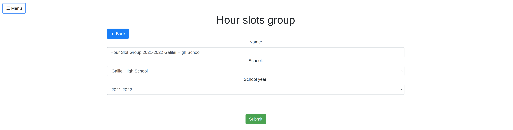

Ora dovresti vedere un elenco di tutti i tuoi gruppi di slot orari:

Clicca sul pulsante `Modifica blocchi` e aggiungi i singoli blocchi orari (usando il pulsante verde `+ Aggiungi nuovo`).

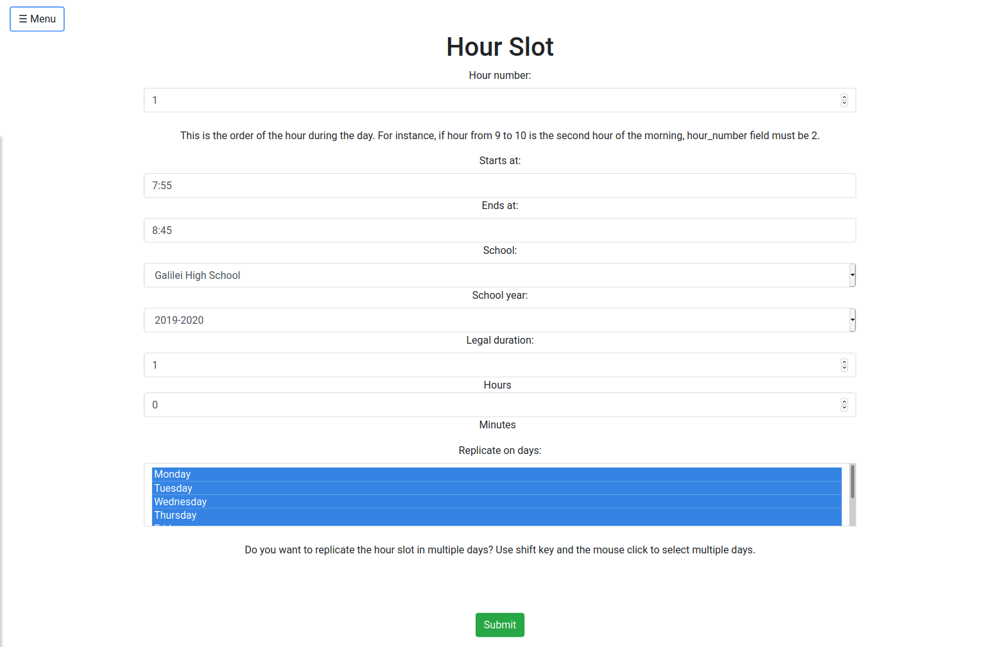

(Nota che in questo caso l'ora dura fisicamente solo 50 minuti, ma la durata legale assicura che verrà conteggiata come un'intera ora di lezione da 60 minuti). Inseriamo sia lo slot orario per la prima ora (7.55-8.45) che per la seconda ora (8.45-9.35).

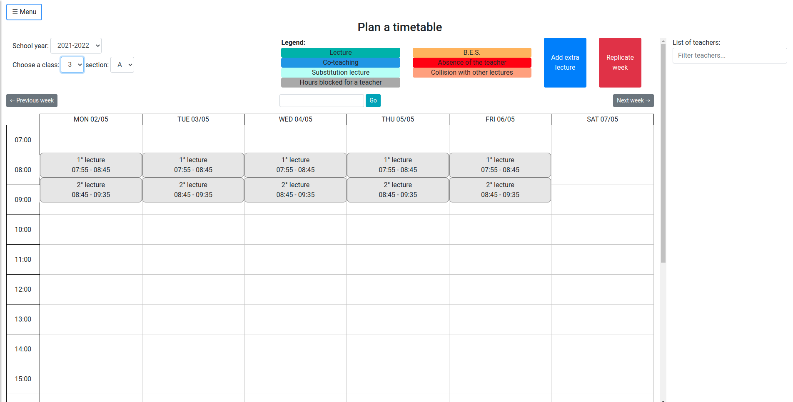

Inseriamo ora alcune classi (1A, 2A, 3A, 4A, 5A): vai nel menù di sinistra -> `Gestisci le entità` -> `Classi` -> `Aggiungi nuovo`, e compila i moduli con le informazioni delle varie classi (attenzione, se il corso è 1A, l'anno sarà 1 - deve essere un numero - mentre la sezione sarà A). Per esempio:

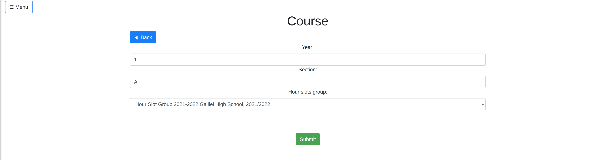

Si noti che il campo Gruppo di Slot Orari definisce l'anno scolastico della classe che si sta inserendo: potresti infatti avere un corso 1A sia nell'anno scolastico 2020-2021 che nel 2021-2022, puoi differenziarli semplicemente guardando il Gruppo di Slot Orari a cui sono associati!

Inseriamo ora alcune materie (menù di sinistra -> `Gestisci le entità` -> `Materie` -> `Aggiungi nuovo`): Matematica, Fisica, Letteratura italiana, Letteratura inglese. Il campo Colore viene utilizzato per definire il colore con cui appariranno nell'orario.

Inseriamo ora alcune aule: non è necessario inserirle tutte (anche se non c'è nessuna controindicazione nel farlo), ma solamente quelle che ritieni possano avere conflitti (ad esempio i laboratori che possono essere utilizzati da più classi).

Per aggiungere alcune aule vai nel menù a sinistra -> `Gestisci le entità` -> `Aule` -> `Aggiungi nuovo`. Creiamo un paio di aule, come il Laboratorio di Fisica (con capacità 2, il che significa che può essere utilizzato contemporaneamente da due classi e non che può ospitare solo due studenti) e il Laboratorio Multimediale (con capacità 1).

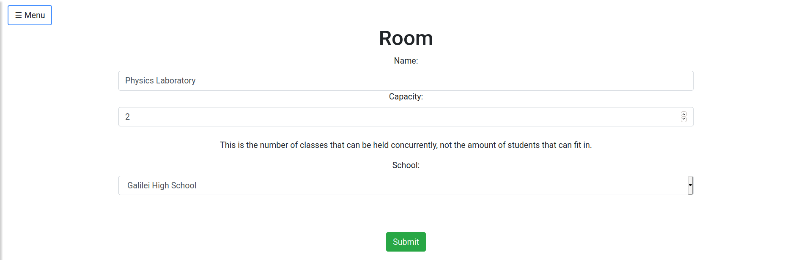

È ora di aggiungere degli insegnanti: vai nel menù a sinistra -> `Gestisci le entità` -> `Insegnanti` -> `Aggiungi nuovo` e crea alcuni insegnanti. Per questo esempio creeremo gli insegnanti Marie Curie, Dante Alighieri, Oscar Wilde e Carl Friedrich Gauss.

Nota che: il campo `username` sarà il nome utente che il docente utilizzerà per effettuare il login - sceglilo con attenzione perché non possono esserci duplicati e non può contenere spazi (si consiglia di usare nome_cognome, ad esempio dante_alighieri può essere il nome utente per il docente Dante Alighieri). Il campo email è necessario poiché l'insegnante riceverà un'email da SchoolCalendar, al fine di impostare la sua password (utilizzerà il suo account per controllare il suo orario personale, ma non potrà modificare nulla non essendo un amministratore!). L'email non è inviata automaticamente: è necessario cliccare sul pulsante `Manda un invito` andando nel menù a sinistra della pagina -> `Gestisci le entità` -> `Insegnanti`.

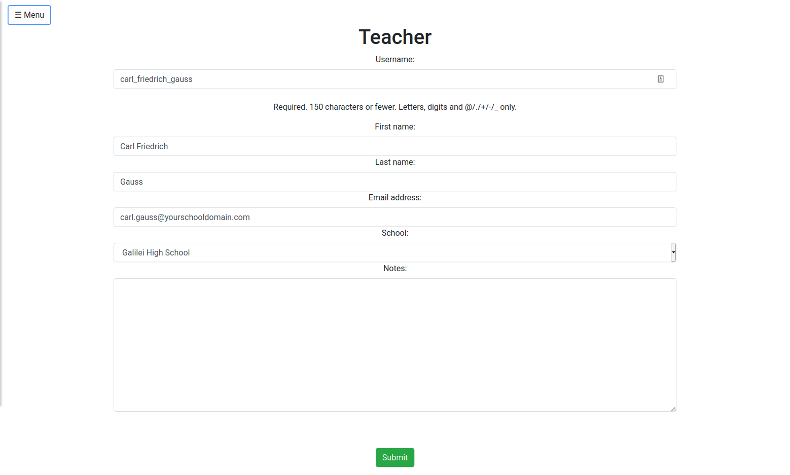

Ora inseriamo un blocco assenza: il povero Dante non può essere presente a scuola il lunedì dalle 7:55 alle 8:45, poiché deve assistere il suo vecchio amico Virgilio. Apri il menù a sinistra -> `Gestisci le entità` -> `Blocco Assenza` -> `Aggiungi nuovo` e completa il form con le informazioni sull'assenza di Dante.

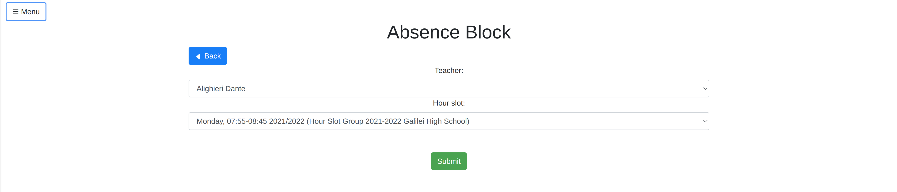

Ora inseriamo le informazioni che riguardano le ore degli insegnanti nei vari corsi. Per cominciare, inseriamo quante ore ogni insegnante deve insegnare a seconda del suo contratto, per l'intero anno scolastico. Ci aspettiamo che questo numero sia circa sulle 1000 ore annuali.

Apri il menù a sinistra -> `Gestisci entità` -> `Carico annuale degli insegnanti` -> `Aggiungi nuovo`, e inserisci le informazioni:

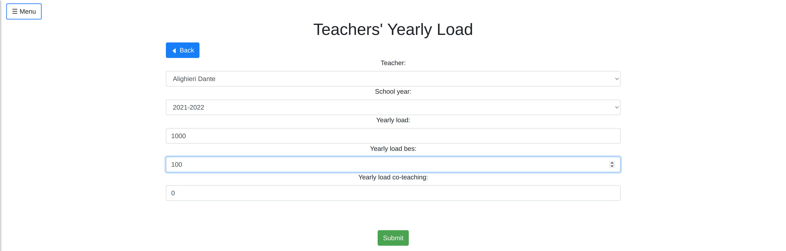

Lo stesso accade per le classi: apri il menù a sinistra, -> `Gestisci le entità` -> `Carico annuale delle classi` -> `Aggiungi nuovo` e compila quante ore ogni classe deve fare entro la fine dell'anno. 

Ora è il momento di inserire quante ore ogni insegnante deve fare nelle varie classi, e per quale materia (ad esempio, se un insegnante è responsabile sia di matematica che di fisica nella stessa classe IA, allora devi inserire due Ore per insegnante, una per le ore di matematica e una per le ore di fisica).

Per semplicità, assumiamo che ogni professore nel nostro esempio insegni la sua materia (Dante -> italiano etc) nelle classi 1A e 2A. Assegnamo 100 ore normali ad ogni insegnante in ogni classe, a parte Dante a cui vengono assegnate anche 50 ore BES. Apri il menù a sinistra -> `Gestisci le entità` -> `Ore per insegnante` -> `Aggiungi nuovo`.

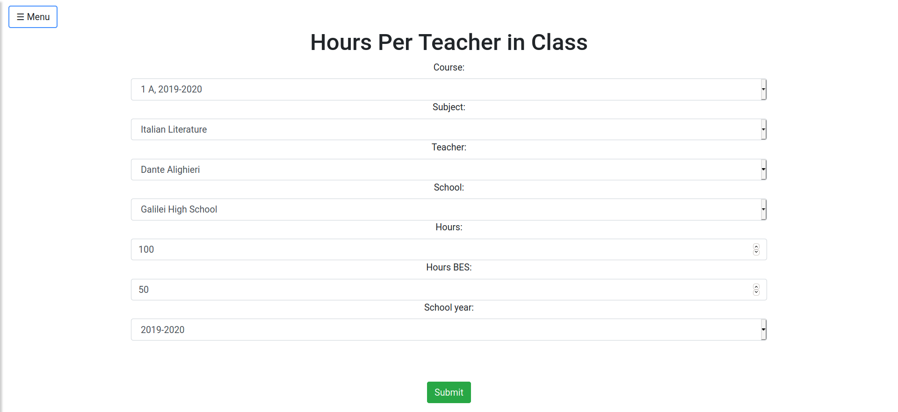

Per concludere, inseriamo qualche vacanza e qualche stage: apri il menù a sinistra -> `Gestisci le entità` -> `Vacanze` -> `Aggiungi nuovo` e crea una nuova vacanza.

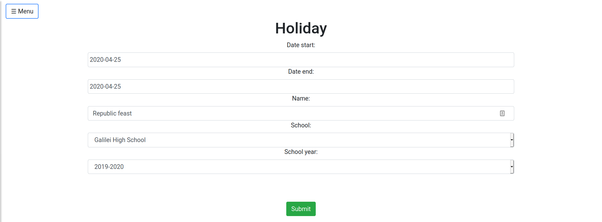

Nota che se crei una vacanza in una giornata nella quale qualche professore era stato precedentemente incaricato di insegnare in qualche classe, verrai avvertito del problema e tali ore lavorative verranno automaticamente cancellate (d'altronde, è vacanza)!

Inoltre, creiamo uno stage per la classe 1A:

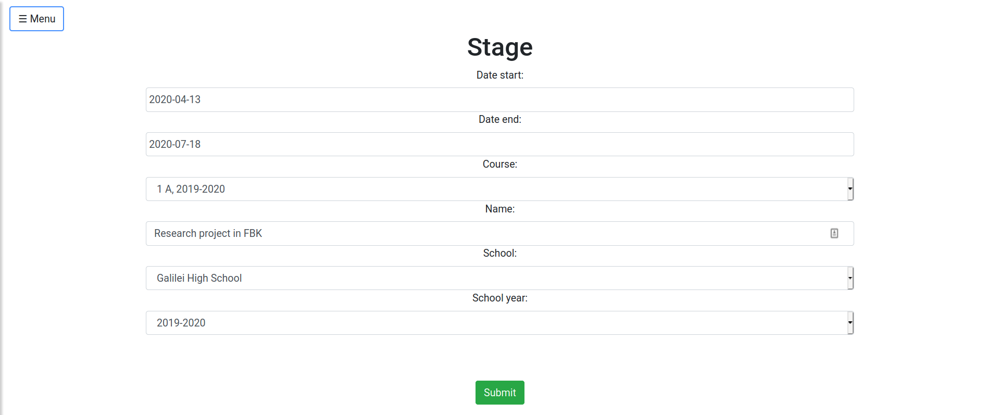

Puoi controllare come questi eventi siano renderizzati nel calendario: apri il menù a sinistra -> `Calendario` e vai alla settimana desiderata usando il bottone `go`, subito sopra il calendario. Vedrai che le vacanze sono facili da riconoscere!

### Assegnamento di professori

Dopo che abbiamo inserito tutte le entità della nostra scuola di test, possiamo finalmente capire come funzioni il sistema. Apri il calendario e comincia a sperimentare con l'assegnamento dei professori.
Questa pagina ti permette di vedere l'orario settimanale per una specifica classe, in un anno scolastico (puoi cambiare l'anno e la classe nel menù in alto a sinistra). Nota che la lista di insegnanti nella colonna di destra cambia in base alla classe che selezioni. Se provi a selezionare il corso 3A, vedrai che non c'è alcun insegnante disponibile (se ricordi, abbiamo aggiunto Ore in classe per insegnante soltanto per le classi 1A e 2A).

Prova ad aggiungere un'ora di italiano lunedì la seconda ora. Clicca `Assign lecture` nel riquadro di Dante, e successivamente clicca la seconda ora del lunedì mattina (dovrebbe essersi colorato di verde, per mostrare che Dante può insegnare in quell'ora).

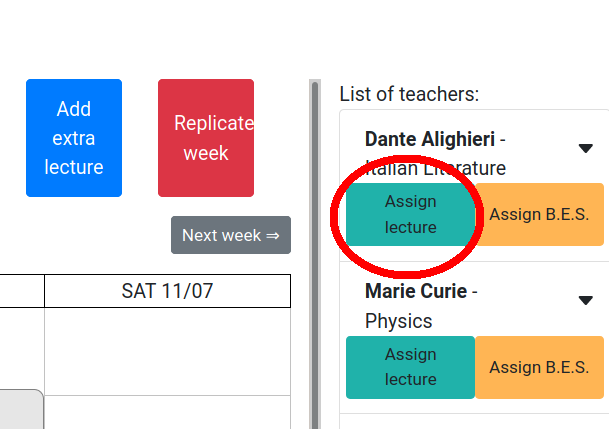

Ti verrà chiesto inoltre se vuoi assegnare un'aula per la lezione, alla cui domanda per ora rispondiamo di no.

E per quanto riguarda il primo slot orario? Perché è colorato in grigio e non è diventato verde? Semplice: Dante è a trovare Virgilio, gli abbiamo aggiunto un blocco assenza per quell'ora.

Per ora tutto bene: aggiungiamo un'ora di matematica la prima ora del lunedì. Ripetiamo la stessa procedura con Gauss. Nota che quando premi il bottone `Assegna lezione` nel riquadro a destra di Gauss, l'ora di italiano che abbiamo aggiunto prima nel calendario viene divisa a metà: questo ti permette di assegnare più insegnanti contemporaneamente durante la stessa ora.

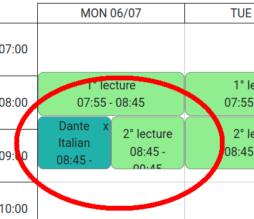

Prima di aggiungere altre lezioni nelle altre classi, prova a cliccare la freccia in basso nel riquadro degli insegnanti nella colonna a destra: ti mostrerà un sommario di quante ore ogni insegnante debba ancora lavorare per concludere il suo carico annuale.

Cambia ora la classe (2A) usando il menù in alto a sinistra. Prova ad aggiungere una lezione per Dante, vedrai che lunedì è fuori discussione: la prima ora Dante è da Virgilio, la seconda invece ci sarebbe un conflitto con la lezione nella classe 1A. I conflitti vengono mostrati in rosso.

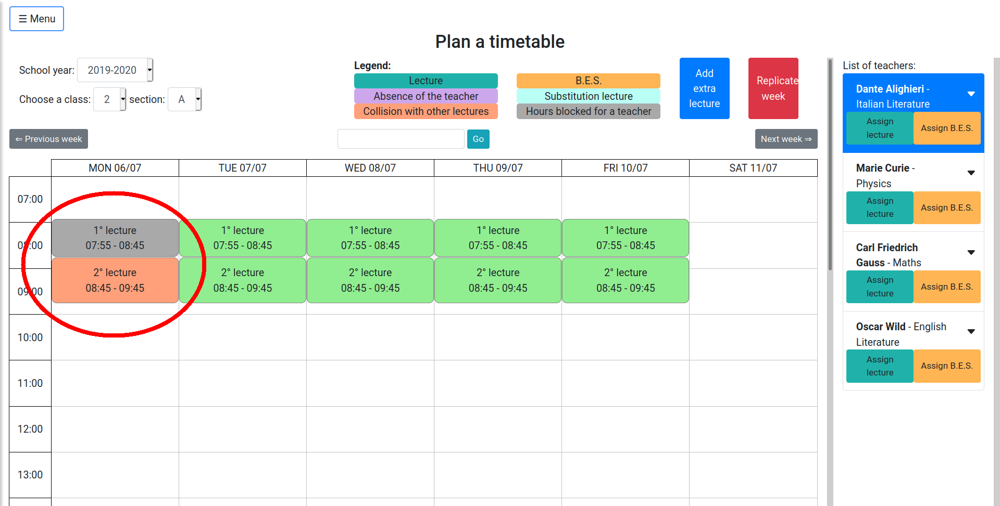

Assegnamo a Dante la prima ora del martedì, e aggiungiamo la lezione nel laboratorio multimediale. Se torni alla classe 1A, e provi ad aggiungere un'altra ora per un altro insegnante (Oscar Wilde) la prima ora del martedì, noterai che il laboratorio multimediale non appare tra le scelte delle aule disponibili. Ciò succede perché abbiamo creato il laboratorio multimediale con capacità di una sola classe.

Se invece ripeti lo stesso procedimento con Marie Curie la seconda ora del martedì nella classe 1A, e aggiungi l'aula nel laboratorio di fisica, e poi fai lo stesso nella classe 2A (Gauss, matematica, seconda ora del martedì nel laboratorio di fisica), noterai che ora il laboratorio di fisica compare tra le scelte di aule disponibili: infatti, il laboratorio di fisica è stato creato con capacità di due classi contemporaneamente.

Ecco un recap delle ore che abbiamo assegnato fino ad ora nelle classi 1A e 2A.

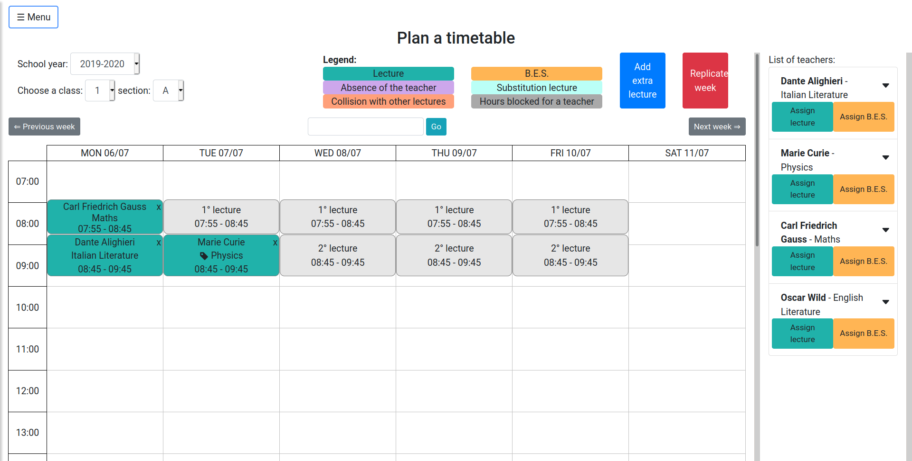
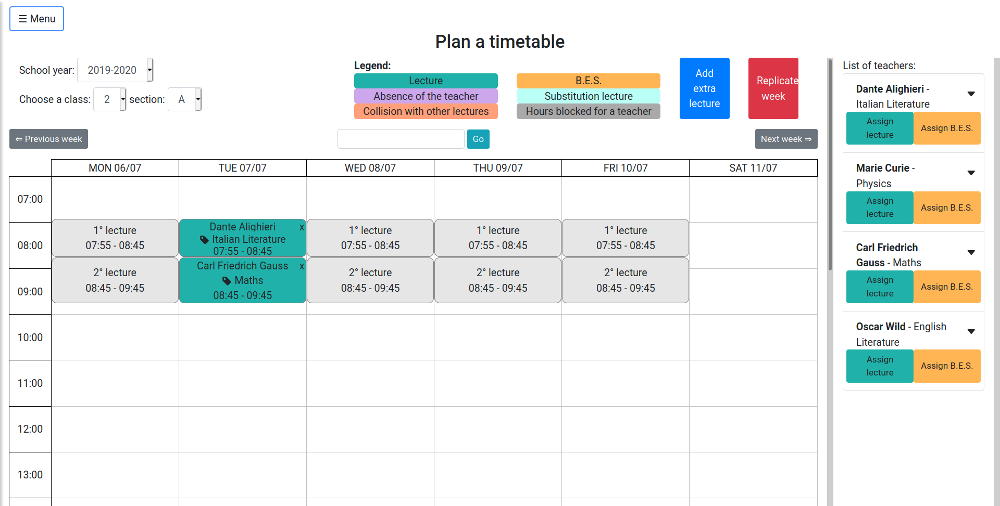

Per concludere il paragrafo, nota che c'è la possibilità di creare blocchi orari speciali, cliccando il bottone blu "Aggiungi lezione extra". Questa funzionalità è utile per registrare lezioni rare che accadono in blocchi orari non-standard: ad esempio, immagina che l'ultimo giorno prima delle vacanze di Natale, la scuola organizzi un evento serale che, ovviamente, deve essere contato come orario di lavoro per i professori!

### Sostituzioni

Esploriamo ora un'altra funzionalità di SchoolCalendar: assumi che sia lunedì sera, e che Gauss ti chiami dicendoti che è malato e non può quindi essere presente per la sua ora del martedì nella classe 2A. È quindi tua responsabilità trovare un sostituto. Normalmente dovresti cercare tutte le ore che Gauss insegna il martedì in tutte le sue classi, e per ogni ora devi trovare il giusto sostituto (non ci possono essere conflitti con le ore del sostituto): un dramma. E con SchoolCalendar? Soltanto ordinaria amministrazione.

Apri il menù a sinistra -> `Sostituisci un professore` e riempi il form con le informazioni relative all'assenza di Gauss del martedì.

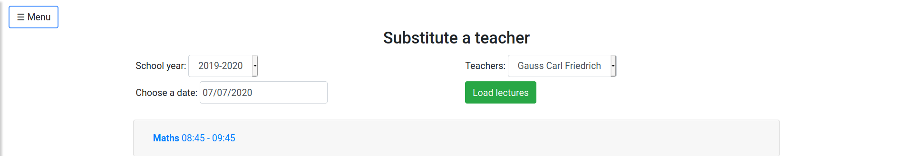

Come puoi notare, ti comparirà una lista di tutte le lezioni che Gauss insegna in quel giorno, e che devi sostituire (nel nostro caso, solo la seconda ora del martedì). Se clicchi sull'ora, ti apparirà una lista di tutti i prof disponibili per quella sostituzione

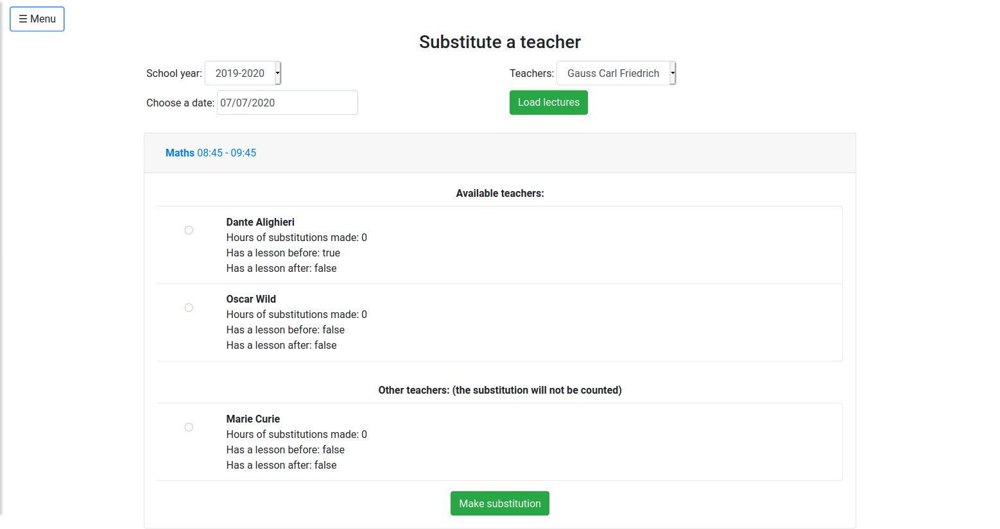

Le informazioni in questa pagina dovrebbero aiutarti a decidere chi debba fare la sostituzione: ad esempio, vorresti poter dare la sostituzione al prof che ha compiuto meno supplenze nel corso dell'anno. Inoltre, vorresti assegnare la sostituzione a professori che sono già a scuola a quell'ora: nota, ad esempio, che Oscar Wilde è a casa il martedì sia l'ora prima sia l'ora dopo la sostituzione, invece Dante sarebbe già a scuola (l'ora prima dell'assenza di Gauss, Dante ha una lezione nella classe 2A). Crediamo che queste informazioni possano tornarti utili nel decidere a chi assegnare la sostituzione.

Infine, puoi vedere che Marie Curie sta già insegnando in un'altra classe in quell'ora, per questo motivo è elencata sotto la lista `Altri professori`: non dovresti sceglierla (altrimenti avrai un conflitto), a meno che tu non abbia buone ragioni per farlo. Ad esempio, la classe di Marie Curie è in gita con altri accompagnatori, e quindi Marie Curie è effettivamente libera di fare la sostituzione). Nota che nel caso tu assegni Marie Curie, la sostituzione è considerata come "gratuita", nel senso che non verrà conteggiata tra le ore che Marie Curie ha fatto (infatti, Marie Curie formalmente si trova in un'altra classe a fare lezione, e già quell'ora viene conteggiata).

Se scegli Dante per la sostituzione, noterai che nel calendario Gauss verrà segnato come assente (in viola), mentre Dante comparirà come il supplente (azzurro). 

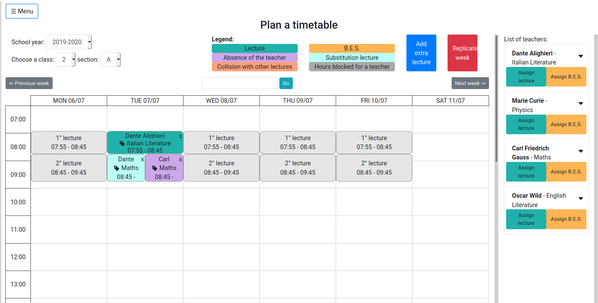

### Replicazione settimana

Dopo aver inserito tutte le lezioni della prima settimana per una classe, dovresti considerare di ripeterle per il resto dell'anno usando il bottone "Replica settimana". Ti eviterà di inserire manualmente ogni ora per il resto dell'anno scolastico. Per utilizzare questa funzionalità devi visualizzare la settimana che vuoi replicare nel calendario. Dopo aver cliccato il bottone "Replica settimana", una finestra di dialogo ti lascerà decidere il periodo entro cui replicare la settimana corrente. Puoi scegliere queste due opzioni:

- Replica la settimana senza le sostituzioni: se abilitato, tutte le sostituzioni presenti nella settimana corrente verranno ignorate, e verrà considerato che per il resto dell'anno il professore assente è in realtà presente.
- Rimuovi le lezioni extra che non creano conflitti: se abilitato, tutte le lezioni già presenti nelle settimane selezionate per la replicazione verranno eliminate, anche se non causano conflitti. Se disabilitato, le lezioni che non causano conflitti vengono tenute.

Se ci sono delle lezioni che creano dei conflitti (ad esempio, lo stesso insegnante sta già insegnando in altri corsi), la replicazione della settimana fallirà. Per sapere che lezioni causano conflitti, clicca il pulsante "Controlla eventuali conflitti", che ti mostrerà una lista di tutte le lezioni che causano conflitti con la settimana replicata.

### Riassunti e report

Nel menù a sinistra, ci sono molte pagine che ti aiutano a gestire l'orario:

- **Report orari**: questa pagina ti permette di scaricare gli orari delle aule, delle classi, degli insegnanti e anche un sommario di tutte le ore della tua scuola in modo compatto.
- **Riassunto degli insegnanti**: questa pagina ti permette di visualizzare quante ore l'insegnante abbia lavorato, e quante ne manchino per raggiungere il suo carico annuale. Se clicchi sul bottone a sinistra di ogni insegnante, otterrai delle informazioni dettagliate sulle ore dell'insegnante nelle sue classi, per ogni materia che insegna.
- **Riassunto delle classi**: simile alla pagina di riassunto degli insegnanti, ma focalizzata sulle classi. Utile per sapere quante ore manchino alla classe per raggiungere il totale delle sue ore.
- **Riassunto delle sostituzioni**: questa pagina ti mostra (e ti permette di scaricare) l'elenco di tutte le sostituzioni della tua scuola durante l'anno scolastico. Puoi anche applicare alcuni filtri (per insegnante, per classe, tempo), così da darti più flessibilità.

## Co-docenza

Può succedere che alcuni insegnanti esterni lavorino nella tua scuola (ad esempio, un lettore/lettrice madrelingua inglese). Questi professori solitamente lavorano assieme ai professori regolari (ad esempio, il professore di inglese). Poiché nel report annuale vuoi che la somma di tutte le ore insegnate dagli insegnanti in una classe sia uguale al numero di ore che quella classe deve lavorare, non vuoi che tali lezioni vengano contate doppie (poiché due professori stanno lavorando assieme). Perciò, puoi assegnare l'ora regolare al professore di inglese, ed un'ora di co-docenza al professore esterno (le ore di co-docenza non vengono conteggiate nei report annuali assieme alle ore regolari, ma sono conteggiate separatamente). Puoi assegnare un'ora di co-docenza dalla pagina del calendario: ogni professore che appare nella colonna di destra ha tre bottoni, uno verde per le ore regolari "Assegna lezione", uno giallo per le ore BES "Assegna B.E.S." e infine uno blu per le ore di co-docenza "Assegna co-docenza".  
